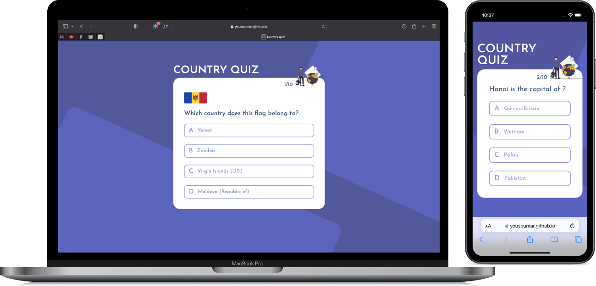

## Country quiz

Avec un gros besoin en logique, ce projet `React` permet de tester sa culture générale sur les pays du mode. Les données proviennent d’une `API` tierce, mises dans une `useRef` pour ne plus faire d'appels durant le jeux.

Eventuelle erreur de l’API, tenter deux fois la même question, la place de la bonne réponse dans les réponses suggérées, tout est pensé à l’avance lors du développement. 

Vous pouvez visiter en cliquant sur l’image ci-dessous ou sur le lien en bas de la section `About`.

<a href = "https://yousoumar.github.io/country-quiz/"></img></a>
