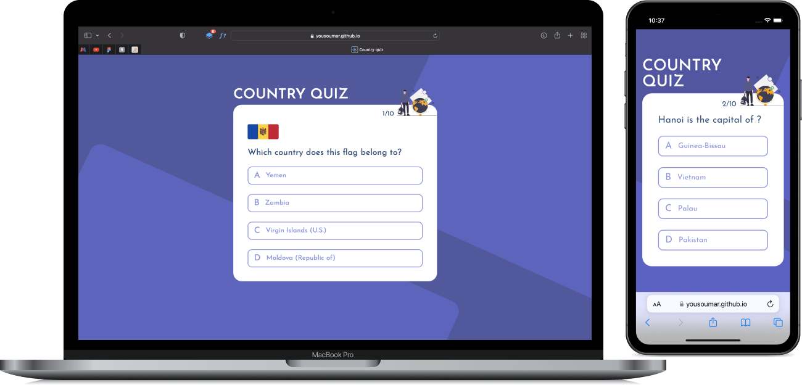

## Country quiz

With a big need for logic, this `React` project allows you to test your general knowledge about countries. The data comes from a third-party `API`, put in a `useRef` to stop making more calls during the game.

Possible API errors, trying the same question twice, the correct answer's place in the suggested ones..., everything is thought out in advance during development.

</img>
